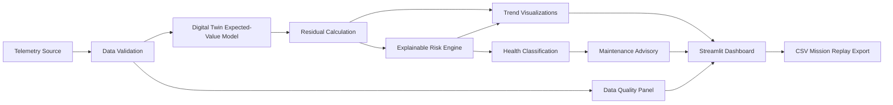
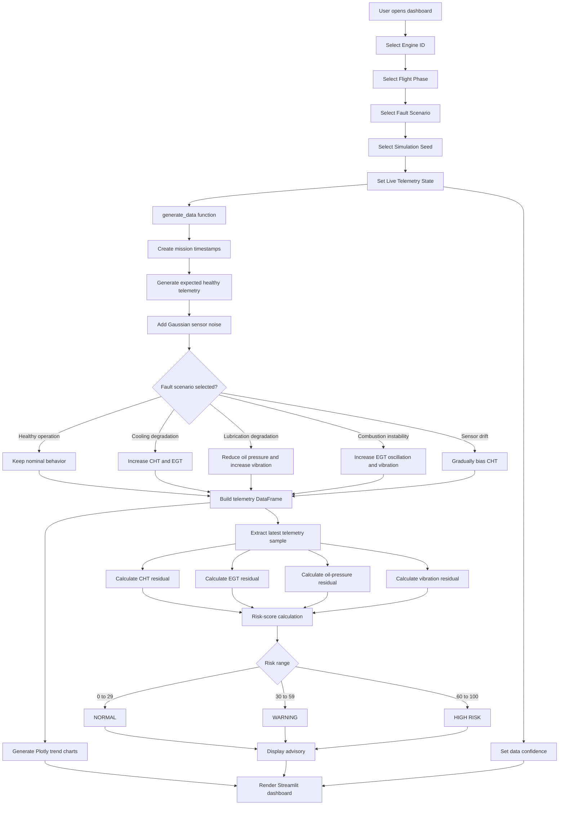
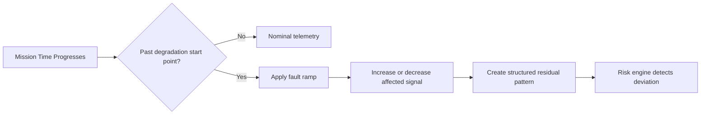
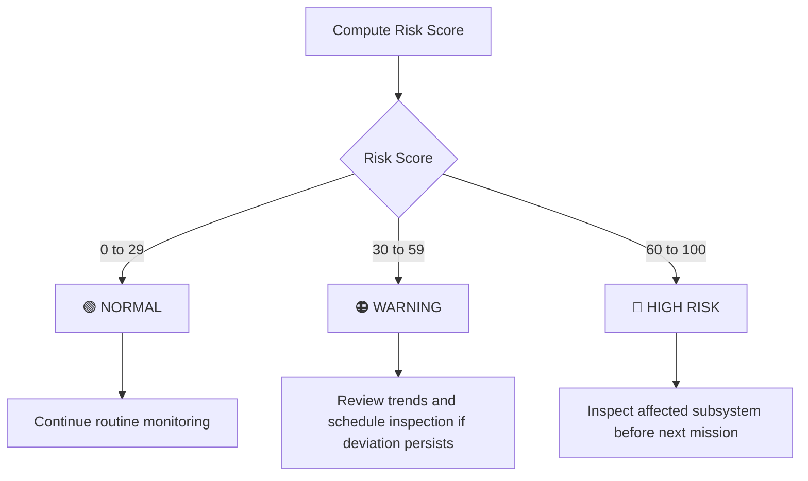

# AeroTwin — AI-Enabled Real-Time Digital Twin for MALE UAV Engine Health Monitoring

AeroTwin is an interactive **Streamlit-based Digital Twin and Explainable AI dashboard** for monitoring simulated MALE UAV piston-engine health. It compares real-time-like sensor telemetry against a physics-informed expected-behavior model, calculates residuals, derives an explainable risk score, and provides an advisory-only maintenance recommendation.

> **Project Status:** Research and demonstration prototype using simulated telemetry.  
> **Safety Position:** The dashboard is advisory-only and must not be used as an operational engine-control or flight-safety decision system without validation against approved test-rig, engine, and certification evidence.

---

## Table of Contents

- [Project Overview](#project-overview)
- [Problem Statement](#problem-statement)
- [System Objectives](#system-objectives)
- [Technical Architecture](#technical-architecture)
- [End-to-End Data Flow](#end-to-end-data-flow)
- [Digital Twin Model](#digital-twin-model)
- [Fault Simulation](#fault-simulation)
- [Residual-Based Anomaly Detection](#residual-based-anomaly-detection)
- [Explainable Risk Scoring](#explainable-risk-scoring)
- [Maintenance Advisory Logic](#maintenance-advisory-logic)
- [Dashboard Design](#dashboard-design)
- [Data Quality and Confidence](#data-quality-and-confidence)
- [Project Structure](#project-structure)
- [Installation](#installation)
- [Usage](#usage)
- [Simulation Parameters](#simulation-parameters)
- [Future Enhancements](#future-enhancements)
- [Limitations and Safety Notes](#limitations-and-safety-notes)

---

## Project Overview

AeroTwin creates a simplified digital representation of an engine operating during a mission. The dashboard produces simulated telemetry, predicts what the telemetry should look like under normal operating conditions, measures the difference between actual and expected values, and explains the resulting engine-health risk.

The core design principle is:

```text
Measured telemetry is compared with digital-twin expected telemetry.
The difference is called a residual.
Residual severity determines anomaly evidence and risk.
Risk determines an advisory-only maintenance recommendation.
```

The dashboard monitors the following engine-health signals:

| Signal | Unit | Health Relevance |
|---|---:|---|
| RPM | rev/min | Engine rotational operating condition |
| CHT | °C | Cylinder thermal stress and cooling effectiveness |
| EGT | °C | Combustion quality and exhaust thermal behavior |
| Oil Pressure | psi | Lubrication-system condition |
| Vibration | g RMS | Mechanical imbalance, wear, or instability |
| Fuel Flow | L/h | Fuel-consumption and operating-load context |

---

## Problem Statement

Engine faults often develop gradually. A conventional threshold-only monitoring approach may detect a problem only after a signal crosses a fixed limit. AeroTwin improves early visibility by comparing measured behavior with a predicted healthy baseline.

For example:

- A CHT reading may remain below an absolute temperature limit but still rise significantly above its expected value.
- Oil pressure may remain technically acceptable but decline relative to the expected lubrication baseline.
- Vibration may increase together with EGT fluctuations, indicating a potential combustion or mechanical issue.
- A sensor may drift gradually even though the physical engine condition remains unchanged.

AeroTwin therefore uses a **model-based anomaly detection approach** rather than relying only on absolute alarm thresholds.

---

## System Objectives

The prototype is designed to:

1. Simulate real-time-like engine telemetry.
2. Represent nominal engine behavior through a digital twin.
3. Inject repeatable fault signatures for testing.
4. Calculate measured-versus-expected residuals.
5. Convert multiple residuals into an explainable risk score.
6. Display trends, thresholds, evidence, and advisories in one dashboard.
7. Allow mission telemetry export to CSV.
8. Demonstrate a foundation for future predictive-maintenance capability.

---

## Technical Architecture

AeroTwin uses a layered architecture so each function has a clear responsibility.



### Architecture Layers

| Layer | Component | Responsibility |
|---|---|---|
| 1 | Telemetry source | Produces sensor time series; currently simulated |
| 2 | Validation layer | Checks telemetry freshness, range assumptions, and quality state |
| 3 | Digital twin | Generates expected values for a healthy engine condition |
| 4 | Residual engine | Calculates deviations between actual and expected values |
| 5 | Risk engine | Converts residual evidence into a bounded 0–100 score |
| 6 | Advisory engine | Maps risk level to operator and maintenance guidance |
| 7 | Dashboard layer | Shows controls, charts, metrics, status, data quality, and export |

---

## End-to-End Data Flow

The following flowchart describes what happens every time the Streamlit dashboard runs or the user changes a sidebar control.



---

## Digital Twin Model

The digital twin is a simplified expected-value model. It estimates what selected engine signals should look like during nominal operation.

The current model uses deterministic sinusoidal baseline behavior to represent normal variation across a mission, with random noise added to represent sensor uncertainty.

### Expected Signal Models

| Signal | Expected Baseline | Normal Variation |
|---|---:|---|
| RPM | 2350 rev/min | Sinusoidal variation plus random measurement noise |
| CHT | 176 °C | Small thermal/load oscillation |
| EGT | 705 °C | Combustion-related oscillation |
| Oil Pressure | 58 psi | Pump/load ripple |
| Vibration | 2.1 g RMS | Mechanical resonance variation |
| Fuel Flow | 35.5 L/h | Load-related variation |

### Expected-Value Concept

The expected model represents the healthy reference state:

```text
Expected telemetry = healthy baseline + normal operating variation
```

The measured model represents observed telemetry:

```text
Measured telemetry = expected telemetry + sensor noise + fault effect
```

The digital-twin comparison lets the dashboard identify whether observed sensor behavior differs meaningfully from expected behavior.

### Production Extension

In a production implementation, the expected model should use operating-condition inputs such as:

- Engine RPM
- Throttle position
- Ambient temperature
- Pressure altitude
- Airspeed
- Flight phase
- Engine load
- Engine operating hours
- Maintenance history

This would reduce false alerts caused by normal changes in mission conditions.

---

## Fault Simulation

AeroTwin provides five selectable scenarios. The simulation seed makes the same scenario repeatable for demonstrations and testing.

| Scenario | Digital Behavior | Simulated Fault Interpretation |
|---|---|---|
| Healthy operation | Normal baseline + noise only | No induced fault |
| Cooling degradation | Rising CHT and EGT after mid-mission | Reduced cooling effectiveness or thermal stress |
| Lubrication degradation | Falling oil pressure and increasing vibration | Lubrication issue or mechanical friction/wear |
| Combustion instability | EGT rise with high-frequency oscillation and vibration increase | Combustion imbalance or unstable fuel-air behavior |
| Sensor drift | Gradual CHT bias | Sensor calibration error or measurement drift |

### Fault Injection Logic

The dashboard introduces faults progressively rather than as instant step changes. This better represents early degradation behavior.



For most degradation modes, the fault ramp begins after approximately 55% of the simulated mission. This makes the first part of the mission resemble a healthy baseline and the later part show developing anomaly evidence.

---

## Residual-Based Anomaly Detection

A residual is the absolute difference between the measured sensor value and the expected digital-twin value.

```text
Residual(sensor) = | Actual(sensor) - Expected(sensor) |
```

### Residuals Used by AeroTwin

```text
CHT Residual
= | CHT Actual - CHT Expected |

EGT Residual
= | EGT Actual - EGT Expected |

Oil-Pressure Residual
= | Oil Pressure Actual - Oil Pressure Expected |

Vibration Residual
= | Vibration Actual - Vibration Expected |
```

### Why Residuals Are Used

Residuals are useful because they are:

- **Interpretable:** Each number maps directly to a physical sensor deviation.
- **Traceable:** The dashboard can state exactly which sensors caused the alert.
- **Low latency:** The calculation is simple and suitable for real-time use.
- **Model-aware:** It detects behavior that is unexpected for the current healthy reference.
- **Suitable for limited labels:** The baseline can be used even when a large labeled fault dataset is not available.

### Example

If the expected CHT is 180 °C and the measured CHT is 194 °C:

```text
CHT Residual = | 194 - 180 |
CHT Residual = 14 °C
```

A large or increasing residual is more informative than the measured temperature alone because it indicates deviation from the specific expected operating state.

---

## Explainable Risk Scoring

AeroTwin converts the latest residual values into a composite engine-health risk score.

```text
Risk Score = min(
    100,
    8
    + 2.2 × CHT Residual
    + 0.7 × EGT Residual
    + 4.0 × Oil-Pressure Residual
    + 30.0 × Vibration Residual
)
```

### Risk-Score Logic

| Term | Meaning |
|---|---|
| Base score = 8 | Represents low background system uncertainty/noise |
| 2.2 × CHT residual | Adds risk for thermal deviation |
| 0.7 × EGT residual | Adds risk for combustion/exhaust deviation |
| 4.0 × oil-pressure residual | Adds risk for lubrication deviation |
| 30.0 × vibration residual | Adds risk for mechanical or instability evidence |
| `min(100, ...)` | Prevents the score from exceeding the 0–100 dashboard scale |

### Coefficient Rationale

| Signal | Weight | Rationale |
|---|---:|---|
| Vibration | 30.0 | A relatively small vibration deviation can signal mechanical imbalance, friction, wear, or unstable combustion |
| Oil Pressure | 4.0 | Oil-pressure decline can indicate lubrication-system risk and should materially influence the health score |
| CHT | 2.2 | Persistent temperature elevation can indicate thermal stress and cooling degradation |
| EGT | 0.7 | EGT is a useful combustion indicator but can vary with operating conditions, so it has a lower weight in this prototype |

### Example Risk Calculation

Assume the latest residuals are:

```text
CHT residual          = 8.0 °C
EGT residual          = 12.0 °C
Oil-pressure residual = 3.0 psi
Vibration residual    = 0.20 g RMS
```

Then:

```text
Risk Score
= min(100, 8 + (2.2 × 8.0) + (0.7 × 12.0) + (4.0 × 3.0) + (30.0 × 0.20))

Risk Score
= min(100, 8 + 17.6 + 8.4 + 12.0 + 6.0)

Risk Score
= 52
```

A score of 52 is classified as a **WARNING** state.

---

## Maintenance Advisory Logic

The dashboard maps the computed score to a simple three-level advisory state.



| Risk Range | Dashboard Status | Maintenance Advisory |
|---:|---|---|
| 0–29 | 🟢 NORMAL | Continue routine monitoring |
| 30–59 | 🟠 WARNING | Review trend data and schedule inspection if deviations persist |
| 60–100 | 🔴 HIGH RISK | Inspect the affected subsystem before the next mission |

The advisory is not an engine command. It is an explainable maintenance-support output.

---

## Dashboard Design

The dashboard is implemented in Streamlit and uses Plotly for interactive trend charts.

### Sidebar Controls

| Control | Purpose |
|---|---|
| Engine ID | Selects the simulated engine instance |
| Flight Phase | Displays mission context |
| Scenario | Selects healthy operation or a fault mode |
| Simulation Seed | Controls reproducible noise and telemetry generation |
| Live Telemetry | Sets live/stale data state and confidence level |

### Key Performance Indicators

The top metric row displays:

- Engine ID
- Flight Phase
- Health Status
- Explainable Risk Score
- Data Confidence

### Digital-Twin Comparison Charts

| Chart | Measured Signal | Expected Signal | Alert Threshold |
|---|---|---|---:|
| Cylinder Head Temperature | CHT Actual | CHT Expected | 205 °C |
| Oil Pressure | Oil Pressure Actual | Oil Pressure Expected | 45 psi |
| Exhaust Gas Temperature | EGT Actual | EGT Expected | 760 °C |
| Vibration Trend | Vibration Actual | Vibration Expected | 3.2 g RMS |

Chart conventions:

```text
Orange solid line = Measured telemetry
Cyan dashed line  = Digital-twin expected behavior
Red dotted line   = Alert threshold
```

### Explainable Risk Panel

The risk panel displays:

- Current health status
- Risk label: Low, Medium, or High
- Risk score from 0 to 100
- CHT residual
- EGT residual
- Oil-pressure residual
- Vibration residual
- Maintenance advisory text

This ensures that an operator can see both the final decision and the sensor evidence behind it.

---

## Data Quality and Confidence

The dashboard includes a data-quality table with the following checks:

| Check | Current Prototype State |
|---|---|
| Timestamp synchronization | Pass |
| Sensor range validation | Pass |
| Telemetry freshness | Live or Stale |
| Model validity | Validated range |
| Audit logging | Enabled indicator |

### Telemetry Confidence

```text
Live Telemetry enabled  → Data Confidence = 96%
Live Telemetry disabled → Data Confidence = 55%
```

When telemetry is marked stale, the dashboard shows a warning:

```text
TELEMETRY LOSS: Data is stale. Dashboard confidence is reduced;
no new health conclusion is issued.
```

This design prevents stale data from being treated as equally reliable as incoming telemetry.

---

## Project Structure

Your local project folder should contain:

```text
aerotwin_x/
│
├── dashboard.py
├── README.md
└── .gitignore
```

### File Description

| File | Purpose |
|---|---|
| `dashboard.py` | Main Streamlit application, simulation logic, risk engine, charts, and export button |
| `README.md` | Technical documentation, architecture, formulas, usage, and project explanation |
| `.gitignore` | Prevents unwanted local files, cache files, environments, and generated exports from being uploaded |

### Recommended `.gitignore`

```gitignore
__pycache__/
*.pyc
.venv/
venv/
.env
.streamlit/
*.csv
```

---

## Installation

### Prerequisites

- Python 3.10 or later
- pip
- VS Code or another Python editor
- Git, if using GitHub version control

### Install Dependencies

Open PowerShell or the VS Code terminal inside the project folder and run:

```bash
pip install streamlit pandas numpy plotly
```

If the `streamlit` command is not available on PATH, use Python module mode:

```bash
python -m streamlit run dashboard.py
```

---

## Usage

### 1. Open the Project Folder

```bash
cd C:\Users\STUDENT\OneDrive\Desktop\aerotwin_x
```

### 2. Start the Dashboard

```bash
python -m streamlit run dashboard.py
```

### 3. Open the Local Application

Streamlit normally displays a local URL in the terminal. Open:

```text
http://localhost:8501
```

### 4. Use the Dashboard

1. Select an engine ID.
2. Select a flight phase.
3. Select a scenario.
4. Start with `Healthy operation`.
5. Compare actual and expected traces.
6. Switch to a degradation scenario.
7. Observe the residual-driven change in risk and advisory.
8. Use the CSV download button to save mission telemetry.

### 5. Stop Streamlit

Return to the terminal and press:

```text
Ctrl + C
```

---

## Simulation Parameters

### Time Series

| Parameter | Value |
|---|---:|
| Samples per mission | 180 |
| Sampling interval | 10 seconds |
| Simulated mission duration | 30 minutes |
| Fault-ramp start | Approximately 55% of mission progress |
| Randomness control | Simulation seed from 1 to 100 |

### Sensor Baselines and Noise

| Signal | Unit | Nominal Baseline | Approximate Noise |
|---|---|---:|---:|
| RPM | rev/min | 2350 | ±12 |
| CHT | °C | 176 | ±1.4 |
| EGT | °C | 705 | ±2.8 |
| Oil Pressure | psi | 58 | ±0.9 |
| Vibration | g RMS | 2.1 | ±0.06 |
| Fuel Flow | L/h | 35.5 | ±0.3 |

---

## Future Enhancements

The current version is a dashboard prototype. A production-oriented evolution could include:

1. **Real telemetry ingestion**  
   Replace synthetic data generation with CAN bus, FADEC, DAQ, MQTT, or logged flight telemetry ingestion.

2. **Context-aware expected model**  
   Condition the digital twin on ambient temperature, altitude, flight phase, power setting, RPM, and engine load.

3. **Sensor-validation logic**  
   Add range checks, rate-of-change checks, stuck-sensor detection, missing-data detection, and sensor cross-validation.

4. **Advanced anomaly detection**  
   Add Isolation Forest, autoencoder, sequence model, or hybrid physics-informed ML methods.

5. **Fault classification**  
   Train a classifier to distinguish cooling faults, lubrication faults, combustion faults, and sensor faults from residual patterns.

6. **Remaining Useful Life estimation**  
   Add degradation tracking and time-to-maintenance estimates where validated lifecycle data is available.

7. **Uncertainty estimation**  
   Replace fixed confidence values with confidence intervals based on sensor quality, model uncertainty, and data freshness.

8. **Fleet monitoring**  
   Compare multiple engines, identify fleet outliers, and track health trends over time.

9. **Persistent storage and audit history**  
   Store telemetry, alerts, residuals, maintenance recommendations, and operator acknowledgements.

10. **Role-based deployment**  
    Add secure access controls for maintenance engineers, operators, and administrators.

---

## Limitations and Safety Notes

- The telemetry in this project is simulated.
- The digital-twin equations are simplified baseline models, not validated engine-performance models.
- Risk coefficients are explainable prototype weights and require engineering calibration before operational use.
- The system does not predict certified remaining useful life.
- The dashboard does not control engine operation.
- The dashboard must not replace approved engine monitoring, flight-control systems, maintenance manuals, or engineering authority.
- Any real deployment requires data validation, sensor calibration, fault-test evidence, cybersecurity controls, verification, validation, and applicable certification review.

---

## License

This project is intended for academic, research, and demonstration purposes.

---

## Author

**AeroTwin Development Team**  
AI-Enabled Real-Time Digital Twin System for MALE UAV Engine Health Monitoring